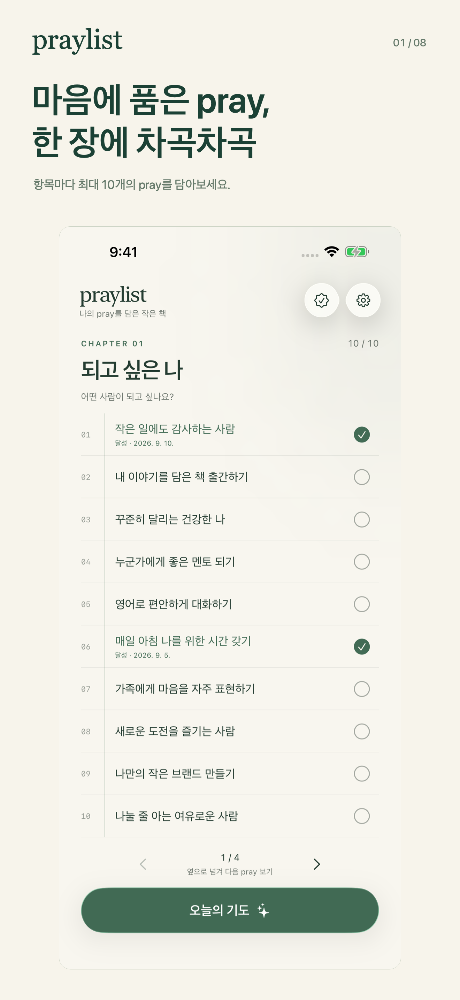
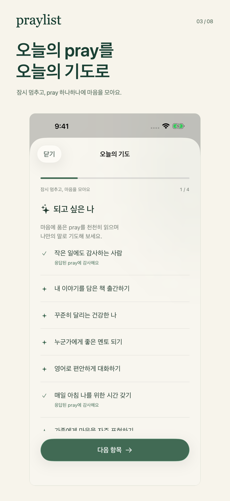
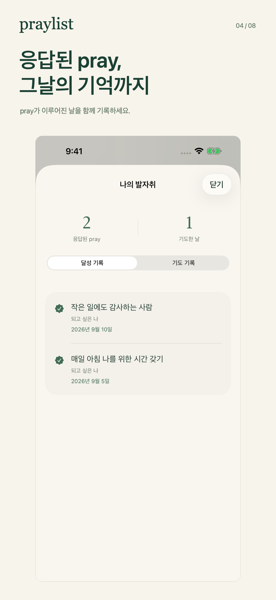
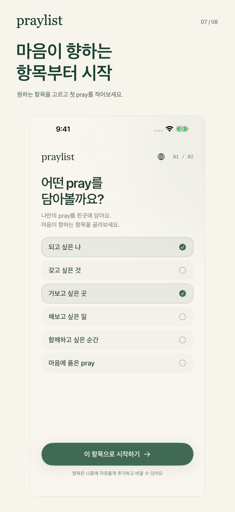
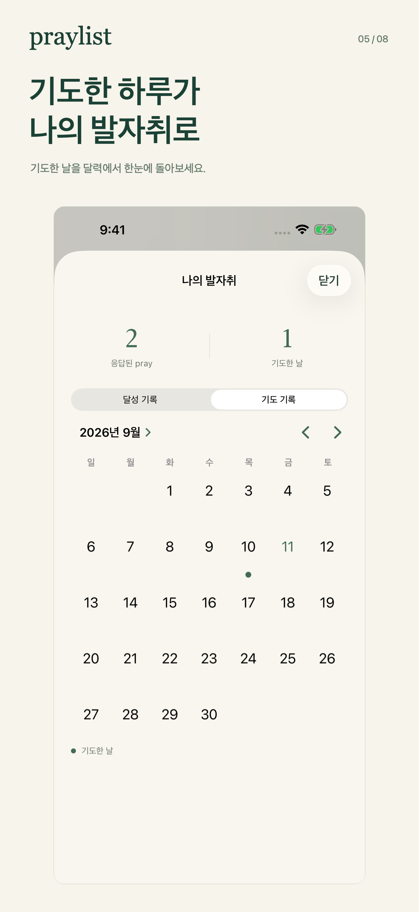
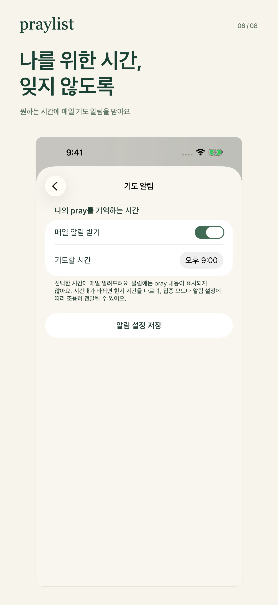

  

<h1 align="center">Praylist</h1>

<strong>마음에 품은 pray, 작은 책 한 권, 매일의 기도.</strong>

<a href="README.md">Read in English</a> · 한국어

어떤 사람이 되고 싶나요? 어디에 가보고 싶나요? 사랑하는 사람들과 어떤 시간을 보내고 싶나요?

Praylist는 나의 버킷리스트와 매일의 기도를 함께 담는 iPhone 앱입니다. 이곳에서는 마음에 품은 하나하나를 **pray**라고 부릅니다. 나에게 중요한 것을 내 말로 적고, 기도하며 다시 만나고, 삶의 일부가 된 날을 기록해 보세요.

  
  
  

## 왜 Praylist를 만들었나요?

되고 싶은 나, 가보고 싶은 곳, 함께하고 싶은 순간은 바쁜 일상 속에서 뒤로 밀리기 쉽습니다. 글로 적으면 마음속에만 있던 것에 자리가 생기고, 다시 읽으면 그것이 나에게 왜 중요한지 떠올릴 수 있습니다.

Praylist는 그 기록과 매일의 기도를 자연스럽게 이어 주고 싶어서 만들었습니다. 나만의 작은 책을 펼치는 느낌이면 좋겠다고 생각했습니다. 몇 줄의 글을 읽고, 한 장을 넘기고, 내 말로 기도할 여유를 찾는 시간이요.

항목마다 최대 열 개의 pray를 담게 한 것도, 빈 줄을 누르면 바로 글을 쓸 수 있게 한 것도 같은 이유입니다. 시작하기 쉽고, 다시 돌아오기 쉬운 앱을 만들고 싶었습니다.

## 이 앱을 통해 무엇을 전하고 싶나요?

Praylist가 나에게 중요한 것을 위해 잠시 시간을 내는 계기가 되었으면 합니다. 다른 사람의 말을 잘 듣는 사람이 되는 것, 가족과 시간을 보내는 것, 오래 마음에 둔 곳에 가보는 것, 나만의 일을 시작하는 것까지 모두 pray가 될 수 있습니다.

어떤 pray는 오래 걸리고, 어떤 pray는 내가 변하는 만큼 달라질 수도 있습니다. 응답된 pray에 날짜를 남기고 기도했던 날들과 함께 돌아보면, 그 기록이 조금씩 성장과 감사, 내가 만들어 가는 삶의 이야기가 되었으면 좋겠습니다.

## 이런 분께 이런 도움이 되었으면 해요

- **하고 싶은 것을 적어 두고 자주 잊는 분께.** 나에게 맞는 항목으로 모아 두고, 책장을 넘기듯 하나씩 다시 만날 수 있는 자리가 되었으면 합니다.
- **꾸준히 기도할 시간을 만들고 싶은 분께.** 원하는 시간에 알림을 받고, 알림을 눌러 오늘의 기도를 열어 각 항목에 잠시 마음을 모을 수 있으면 좋겠습니다.
- **나에게 중요했던 순간을 기억하고 싶은 분께.** 응답된 pray의 날짜를 나의 발자취에 남기고, 기도 기록 달력에서 내가 기도한 날들을 돌아볼 수 있습니다.
- **조용한 개인 공간을 찾는 분께.** 계정 없이 시작하고, 광고나 앱 내 분석 도구 없이 기기에 나의 노트를 보관할 수 있습니다.

## 첫 pray에서 나만의 일상으로

1. **나의 페이지를 고르세요.** 되고 싶은 나, 해보고 싶은 일, 가보고 싶은 곳 등 마음이 향하는 항목을 고릅니다. 필요하면 나만의 항목도 만들 수 있습니다.
2. **pray 하나를 적어 보세요.** 빈 줄을 누르고 떠오르는 내용을 적은 뒤 키보드의 완료를 누르면 저장됩니다. 쓴 글을 다시 누르면 바로 고칠 수 있습니다.
3. **기도하며 다시 만나세요.** 옆으로 페이지를 넘기고 오늘의 기도를 열어 보세요. 기도를 마친 날을 기록하고, 필요하면 매일의 알림도 설정할 수 있습니다.
4. **응답된 날을 기억하세요.** pray가 이루어진 날을 선택해 남겨 보세요. 나의 발자취에서 응답된 pray와 기도 기록 달력을 함께 돌아볼 수 있습니다.

  
  
  

## iPhone에서 익숙하고 편안하게

익숙한 iPhone 기본 조작과 책 표지를 넘기는 짧은 애니메이션을 담았습니다. iOS 26 이상에서는 Liquid Glass를 사용합니다. 항목마다 열 칸을 두고, 큰 글자가 필요할 때는 스크롤해서 편하게 읽을 수 있도록 했습니다. 응답된 pray도 열 개의 자리에 포함됩니다.

**한국어와 영어**를 지원하며 앱 안에서 언제든 언어를 바꿀 수 있습니다. 자동 선택은 iPhone 지역 설정이 한국이면 한국어, 그 외에는 영어를 사용합니다. 직접 쓴 글은 언어를 바꿔도 그대로 남습니다.

노트는 기기에 저장됩니다. 파일 앱으로 JSON 백업을 내보내고 나중에 복원할 수 있습니다. 앱 자체 클라우드 동기화는 제공하지 않으며, iOS 설정에 따라 노트가 기기 백업에 포함될 수 있습니다. 내보낸 파일에는 별도 암호 없이 작성 내용이 담기므로 안전한 곳에 보관해 주세요.

*이미지는 가상의 예제 기록을 넣은 실제 앱 화면입니다. iOS 18 이상의 iPhone을 지원합니다.*

**오늘 시간을 내어 마음에 담고 싶은 pray 하나부터 시작해 보세요.**

[사용 안내](https://www.visionexperiencedeveloper.com/ko/supports/praylist) · [개인정보 처리방침](https://www.visionexperiencedeveloper.com/ko/policies/praylist) · [English introduction](README.md)

개발자를 위한 안내

Swift와 SwiftUI, iOS 기본 프레임워크와 기기 내 저장 기능으로 만들었습니다.

- [빌드 및 개발 가이드](docs/DEVELOPMENT.md)
- [아키텍처](docs/ARCHITECTURE.md)
- [C4 다이어그램과 ERD](docs/architecture/C4-ERD.md)
- [사용자 흐름·유스케이스·제품 운영 다이어그램](docs/product/PRODUCT-DIAGRAMS.md)
- [검증 범위와 기록](docs/QA.md)
- [출시 자료](release/RELEASE.md)

