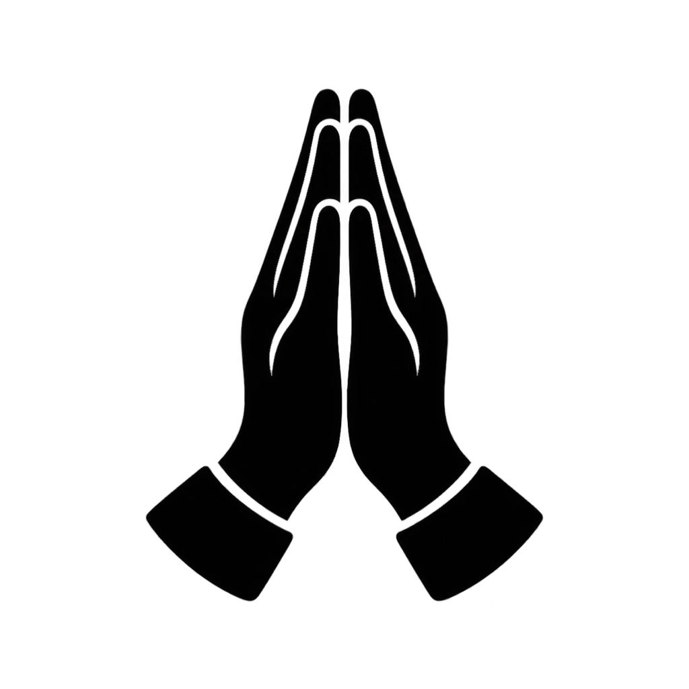
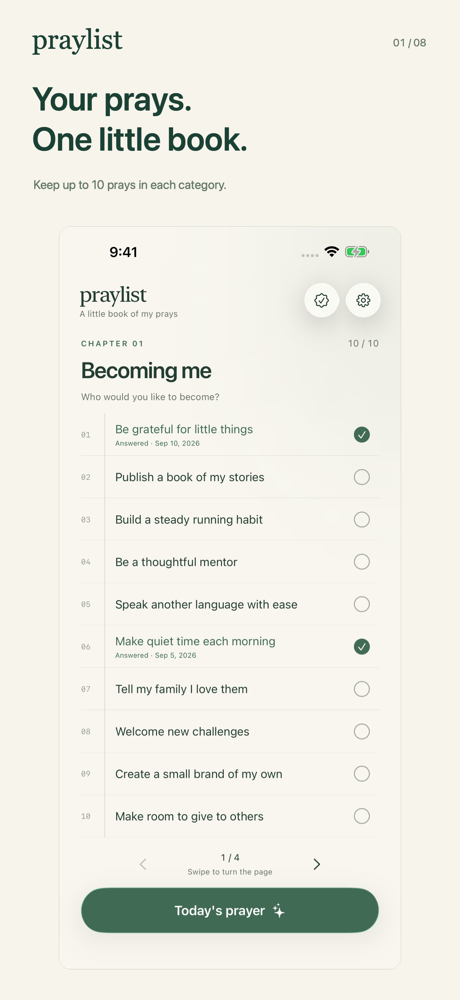
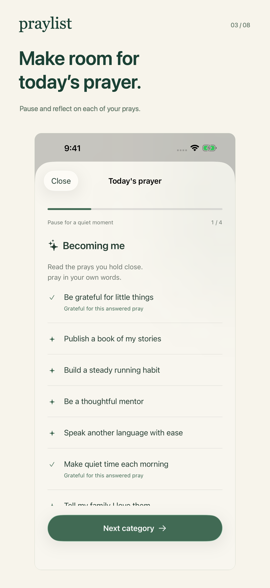
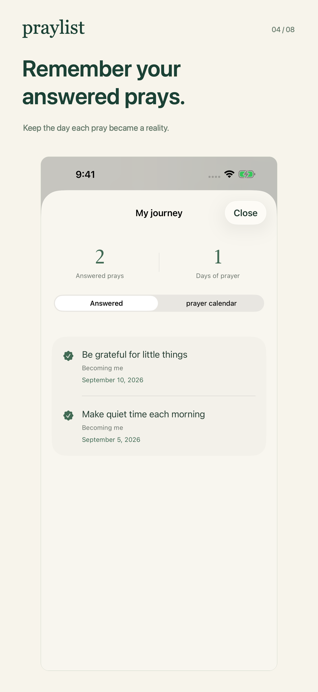
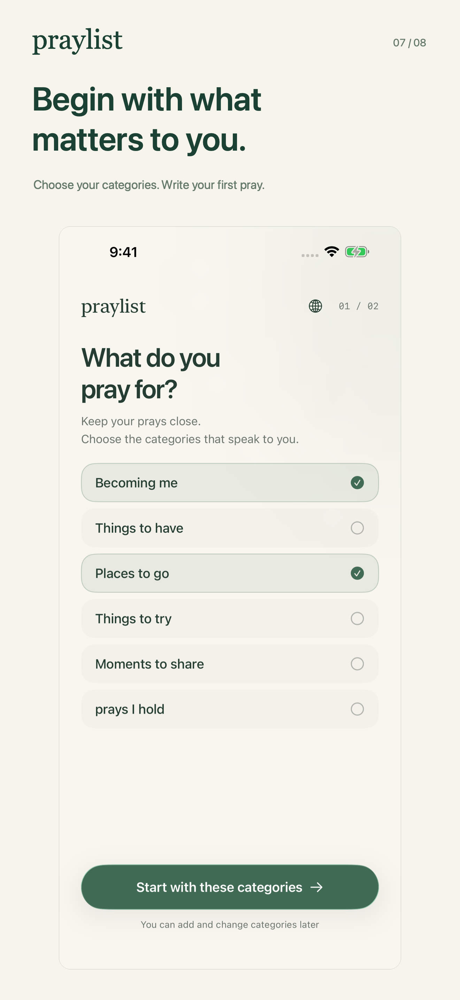
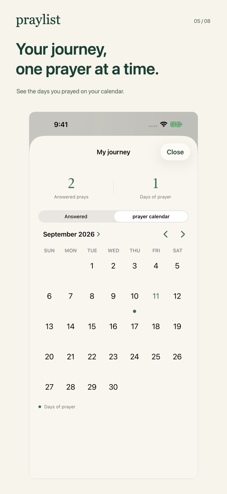
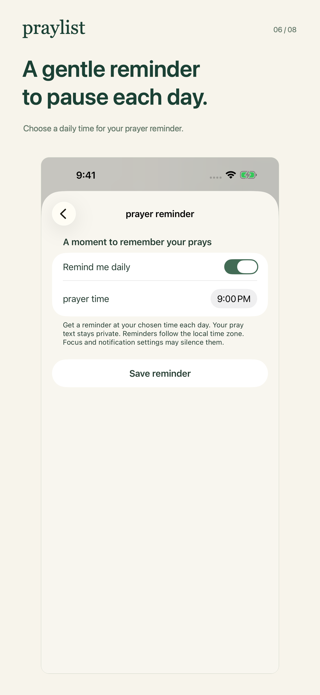

  

<h1 align="center">Praylist</h1>

<strong>Your prays. A little book. A daily moment of prayer.</strong>

English · <a href="README.ko.md">한국어로 읽기</a>

Who would you like to become? Where would you like to go? What would you like to experience with the people you love?

Praylist is a personal bucket-list and prayer journal for iPhone. Each entry is a **pray**: something that matters to you, written in your own words. Gather your prays, return to them in prayer, and keep the dates and memories when they become part of your life.

  
  
  

## Why I made Praylist

The person we want to become, the places we want to visit, and the moments we want to share can be easy to set aside in everyday life. Writing them down gives them a place. Returning to them gives us a moment to remember why they matter.

I made Praylist to bring that writing and daily prayer together. I wanted it to feel like opening a small personal book: a few meaningful lines, a page to turn, and enough quiet to pray in your own words.

That is why each category holds up to ten prays, and why writing starts with a tap on an empty line. The app should make it easy to begin and easy to come back.

## What I hope it brings to your day

My hope is that Praylist helps you make room for what matters to you. A pray might be learning to listen well, making time for family, visiting a place you have long wanted to see, or finally starting something of your own.

Some prays will take time. Some will change as you do. When you mark one as answered, you can keep its date and look back on it alongside the days you prayed. Over time, those entries can become a personal record of growth, gratitude, and the life you are building.

## A place for you, if…

- **You write down plans and rarely return to them.** Gather them into categories that feel like you, then turn through your prays a page at a time.
- **You want a regular moment of prayer.** Choose an optional daily reminder. Tap the notification to open today's prayer and spend a little time with each category.
- **You want to remember the moments that mattered.** Save the date of an answered pray and revisit it in My journey. The prayer calendar marks the days you recorded a prayer.
- **You prefer a quiet, personal space.** Start without an account. Your notebook is stored on your device, with no ads or analytics in the app.

## From your first pray to your own daily rhythm

1. **Choose your pages.** Pick categories for who you want to become, things to try, places to go, and more. Create your own whenever you need to.
2. **Write one pray.** Tap an empty line, write what is on your mind, and finish with Done. Tap the same words whenever you want to edit them.
3. **Return in prayer.** Swipe between pages, open today's prayer, and record the day when you finish. You choose whether to set a reminder.
4. **Remember the answer.** Mark a pray as answered and save its date. My journey keeps those moments together with your prayer calendar.

  
  
  

## Made to feel at home on your iPhone

Praylist uses familiar iPhone controls, a gentle book-opening animation, and Liquid Glass on iOS 26 or later. Each category has ten spaces, with room to scroll when larger text needs it. Answered prays remain part of that ten-entry page.

Use **English or Korean**, and switch languages in the app whenever you like. Automatic selection uses Korean when your iPhone Region is Korea and English elsewhere. Your own writing stays as you wrote it.

Your notebook is stored locally. You can export a JSON backup to Files and restore it later. There is no app-managed cloud sync; iOS device backups may include your notebook according to your settings. Exported files contain your writing without a separate password, so keep them somewhere you trust.

*The images show the actual app with fictional example entries. Praylist supports iPhone with iOS 18 or later.*

**Start with one pray you want to make time for.**

[Support](https://www.visionexperiencedeveloper.com/en/supports/praylist) · [Privacy policy](https://www.visionexperiencedeveloper.com/en/policies/praylist) · [한국어 소개](README.ko.md)

For developers

Built with Swift and SwiftUI, using native iOS frameworks and local storage.

- [Build and development guide (Korean)](docs/DEVELOPMENT.md)
- [Architecture](docs/ARCHITECTURE.md)
- [QA evidence and scope](docs/QA.md)
- [Release materials](release/RELEASE.md)

