# Praylist C4 다이어그램과 ERD

기준일: 2026-09-22  
대상: 현재 저장소의 iOS 앱 구현과 `PrayData` 스키마 버전 1

이 문서는 현재 코드에서 확인되는 런타임 경계와 저장 모델을 설명한다. Praylist는 서버나 계정 시스템이 없는 로컬 우선 iPhone 앱이다. C4는 컨텍스트, 컨테이너, 컴포넌트 수준까지만 사용하며, 클래스 수준 세부사항은 ERD와 코드에 맡긴다.

## 1. 시스템 컨텍스트



[Mermaid 원본](diagrams/c4-context.mmd)

- 사용자의 노트 데이터는 앱의 자체 서버로 전송되지 않는다.
- 알림은 iOS가 기기에서 예약·표시한다. 알림 본문에는 사용자의 pray가 들어가지 않는다.
- JSON 백업은 사용자가 내보내기 또는 복원을 실행할 때만 선택한 파일 제공자와 오간다.
- 지원 및 개인정보 처리방침 링크만 공개 VXD 웹사이트를 연다.

## 2. 컨테이너



[Mermaid 원본](diagrams/c4-container.mmd)

Praylist의 실행 가능한 컨테이너는 iOS 앱 하나다. 앱 내부 데이터는 두 저장 경계로 나뉜다.

- `Application Support/Praylist/praylist-v1.json`: 노트, 기도한 날짜, 알림 설정을 담는 주 저장소
- `UserDefaults`의 `praylist.language`: 백업에 포함하지 않는 기기별 언어 선택

주 저장 파일은 `PrayStore`가 `.atomic` 및 `completeFileProtectionUntilFirstUserAuthentication` 옵션으로 기록한다. 앱이 직접 운영하는 원격 API, 데이터베이스, 인증, 분석 시스템은 없다.

## 3. iOS 앱 컴포넌트



[Mermaid 원본](diagrams/c4-component.mmd)

핵심 쓰기 경계는 `@MainActor @Observable PrayStore`다. 화면은 저장 모델을 직접 파일에 쓰지 않고 `PrayStore`의 명령을 호출한다. 저장 변경은 다음 순서를 지킨다.

1. 현재 `PrayData` 값을 복사한다.
2. 변경 클로저를 복사본에 적용한다.
3. `PrayData.validated()`로 전체 불변 조건을 확인한다.
4. JSON을 원자적으로 기록한다.
5. 파일 쓰기가 성공한 뒤 메모리 상태를 교체한다.

`ReminderService`의 알림 예약과 JSON 저장은 별도 시스템에 걸친 작업이다. 설정 저장이 실패하면 화면 로직이 이전 알림 예약으로 되돌리기를 시도한다. 백업 복원은 기기 권한을 이식하지 않도록 `reminder.enabled`를 `false`로 바꾼다.

## 4. 논리 ERD



[Mermaid 원본](diagrams/erd.mmd)

이 그림은 관계형 데이터베이스 ERD가 아니라 단일 JSON 문서를 이해하기 쉽게 논리 엔터티로 펼친 것이다.

- 실제 저장은 `PrayData` 루트 객체 하나이며 외래 키는 저장하지 않는다.
- `categories`와 각 `prays`의 배열 순서가 화면 순서다.
- `PrayerDay`는 별도 객체가 아니라 `yyyy-MM-dd` 문자열 배열의 한 원소다.
- `ReminderPreference`는 루트 안에 중첩된 단일 객체다.
- UUID 기본 식별자는 `PrayCategory`와 `Pray`에만 존재하며 전체 문서 안에서 각각 중복될 수 없다.
- `achievedAt`은 선택 값이고, 값이 있으면 현재보다 미래일 수 없다.
- `LanguageSettings`는 `UserDefaults`에 저장되므로 이 ERD와 JSON 백업 범위에 포함되지 않는다.

## 코드 근거

- 앱 조립과 알림 탭 라우팅: [`Praylist/App/PraylistApp.swift`](../../Praylist/App/PraylistApp.swift)
- 데이터 모델과 불변 조건: [`Praylist/Models/PrayData.swift`](../../Praylist/Models/PrayData.swift)
- JSON 저장 트랜잭션: [`Praylist/Services/PrayStore.swift`](../../Praylist/Services/PrayStore.swift)
- 로컬 알림: [`Praylist/Services/ReminderService.swift`](../../Praylist/Services/ReminderService.swift)
- 언어 설정: [`Praylist/Services/Localization.swift`](../../Praylist/Services/Localization.swift)
- 백업·복원 UI: [`Praylist/Views/SettingsView.swift`](../../Praylist/Views/SettingsView.swift)

## 변경 시 갱신 기준

- 외부 시스템, 서버 동기화, 계정 기능이 추가되면 컨텍스트와 컨테이너 다이어그램을 갱신한다.
- 새로운 서비스 경계나 쓰기 소유자가 생기면 컴포넌트 다이어그램을 갱신한다.
- `schemaVersion` 증가, 필드 또는 중첩 관계 변경 시 ERD와 제약 설명을 함께 갱신한다.

Mermaid 원본을 수정한 뒤 저장소 루트에서 SVG를 다시 생성한다.

```sh
for source in docs/architecture/diagrams/*.mmd; do
  npx --yes @mermaid-js/mermaid-cli@11.12.0 \
    -i "$source" -o "${source%.mmd}.svg" -b transparent
done
```
