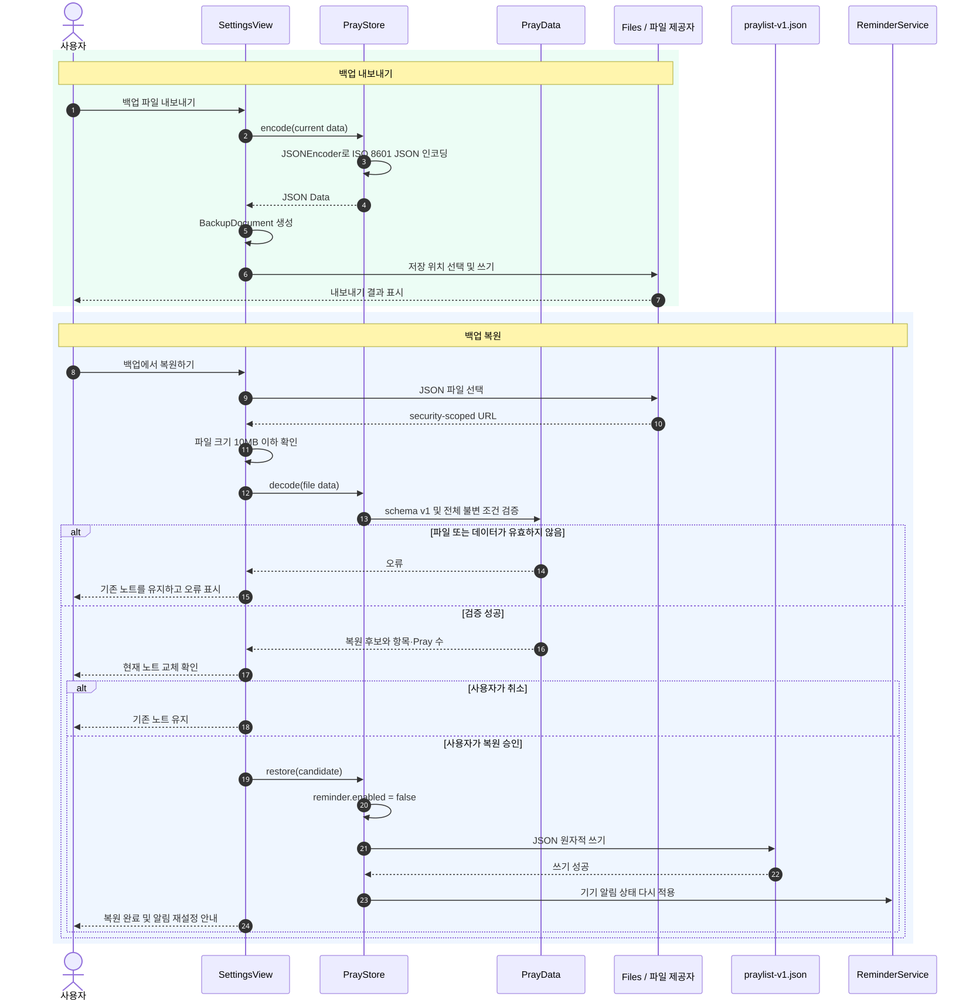

# Praylist 제품·운영 다이어그램

기준일: 2026-09-22<br>
대상 독자: 제품 책임자, 디자이너, 개발자, QA·릴리스 담당자, 미래 유지보수자

이 문서는 Praylist를 계속 개선하고 운영할 때 공통 언어로 사용할 흐름을 모은다. 사용자 흐름·유스케이스·상태·백업 시퀀스는 현재 구현을 설명한다. 제품 운영 루프와 근거 기반 의사결정 맵은 반복해서 따라야 할 운영 기준이며, 모든 단계가 자동화되었다는 의미는 아니다.

구조와 저장 모델은 [C4 다이어그램과 ERD](../architecture/C4-ERD.md), 구체적인 출시 증거는 [출시 문서](../../release/RELEASE.md), 테스트 범위는 [QA 기록](../QA.md)을 함께 본다.

## 1. 온보딩 흐름



[Mermaid 원본](diagrams/onboarding-flow.mmd)

현재 온보딩은 `항목 선택 → 첫 Pray 작성`의 두 단계다. 첫 단계는 기본적으로 `되고 싶은 나`와 `가보고 싶은 곳`을 선택하며 최소 한 항목이 필요하다. 두 번째 단계는 선택한 항목 중 하나와 공백 제거 후 비어 있지 않은 최대 80자의 첫 Pray 제목을 요구한다. 완료 시 선택 항목, 첫 Pray, `onboarded = true`를 하나의 `PrayStore` 업데이트로 검증·저장하며, 실패하면 두 번째 단계에 머물러 오류를 표시한다.

계정 생성, 알림 권한 요청, 백업 안내, 사용자 정의 항목 생성은 현재 온보딩에 포함되지 않는다. 언어는 두 단계에서 바꿀 수 있으며 별도의 `UserDefaults`에 저장된다.

## 2. 전체 사용자 흐름



[Mermaid 원본](diagrams/user-flow.mmd)

이 흐름은 첫 실행부터 반복 사용, 오류 복구, 알림 진입까지 현재 앱의 주요 분기를 한 장에 담는다. 핵심 활성화 지점은 첫 Pray가 검증·저장되어 노트 화면에 도달하는 순간이다. 반복 가치 루프는 `노트 확인 → 오늘의 기도 → 기도일 기록 → 나의 발자취`다.

## 3. 유스케이스



[Mermaid 원본](diagrams/use-cases.mmd)

사용자가 모든 주요 유스케이스의 주 액터다. iOS 알림 시스템, Files 또는 다른 파일 제공자, VXD 공개 웹사이트는 보조 액터이며 Praylist가 운영하는 백엔드가 아니다.

## 4. Pray 상태 전이



[Mermaid 원본](diagrams/pray-lifecycle.mmd)

`Pray` 모델에는 별도의 상태 열거형이 없다. 영속 상태는 `achievedAt`의 유무로 결정된다. `미저장 입력`은 SwiftUI 입력 필드에만 존재하는 임시 상태이며 JSON 스키마에는 포함되지 않는다.

## 5. 백업·복원 시퀀스



[Mermaid 원본](diagrams/backup-restore-sequence.mmd)

복원은 현재 노트를 교체하는 명시적 사용자 작업이다. 파일 크기, 스키마 버전, 데이터 불변 조건을 확인한 뒤 사용자 확인을 받고 원자적으로 기록한다. 실패하면 기존 메모리 상태와 기존 파일을 유지한다. 알림 권한은 백업으로 이동하지 않으므로 복원된 알림 설정은 꺼진다.

## 6. 지속적인 제품·릴리스 운영 루프



[Mermaid 원본](diagrams/product-operations-loop.mmd)

각 릴리스는 `근거 수집 → 제품 결정 → 구현·검증 → 배포 → 운영·학습`을 한 바퀴 돈다. 로컬 빌드 성공, Apple 업로드 성공, 심사 제출, 승인, 실제 공개는 서로 다른 상태다. 원격 상태는 작업 시점에 App Store Connect에서 다시 읽어야 하며 과거 문서만으로 현재 상태를 단정하지 않는다.

## 7. 근거에서 의사결정까지



[Mermaid 원본](diagrams/evidence-decision-map.mmd)

현재 앱에는 분석·광고 SDK가 없으므로 앱 내 행동 퍼널을 측정하지 않는다. 제품 판단은 테스트, 직접 런타임 QA, App Store Connect 상태, 지원·리뷰와 Apple이 제공하는 진단처럼 이미 존재하는 근거를 사용한다. 향후 분석을 도입하려면 구현보다 먼저 사용자 가치, 최소 수집 범위, 동의·고지, 보존·삭제 정책을 별도로 결정해야 한다.

## 다이어그램별 갱신 책임

| 변경 종류 | 함께 갱신할 다이어그램 |
| --- | --- |
| 온보딩 단계, 기본 선택, 첫 Pray 규칙 변경 | 온보딩 흐름, 전체 사용자 흐름, 유스케이스 |
| 화면 진입점이나 주요 행동 변경 | 전체 사용자 흐름, 유스케이스 |
| Pray 생성·달성·삭제 규칙 변경 | Pray 상태 전이, ERD |
| 백업 포맷·검증·복원 정책 변경 | 백업·복원 시퀀스, ERD |
| 테스트·배포·심사 절차 변경 | 제품·릴리스 운영 루프 |
| 개인정보, 진단, 분석 수집 범위 변경 | 근거 기반 의사결정 맵, 개인정보 문서 |

## 렌더링

Mermaid 원본을 수정한 뒤 저장소 루트에서 SVG를 다시 생성한다.

```sh
for source in docs/product/diagrams/*.mmd; do
  npx --yes @mermaid-js/mermaid-cli@11.12.0 \
    -i "$source" -o "${source%.mmd}.svg" -b transparent
done
```
